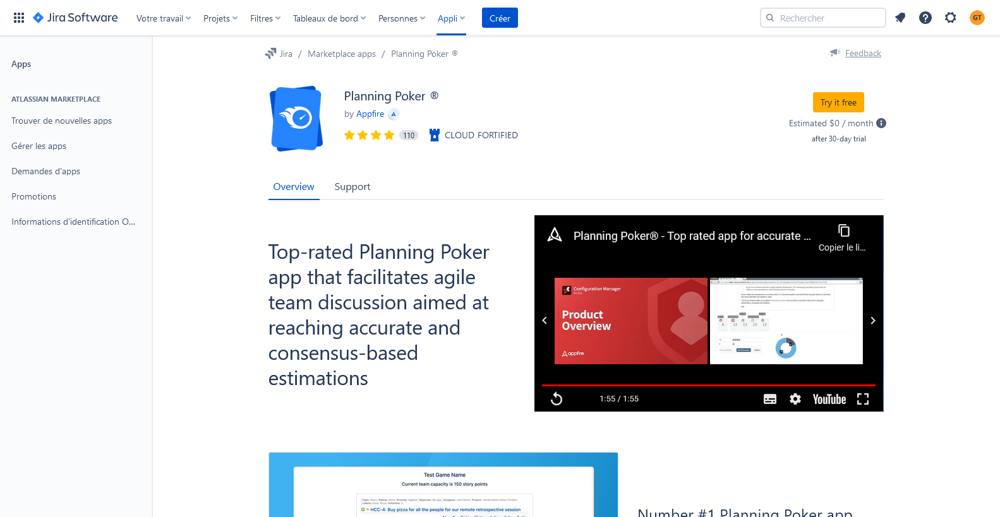
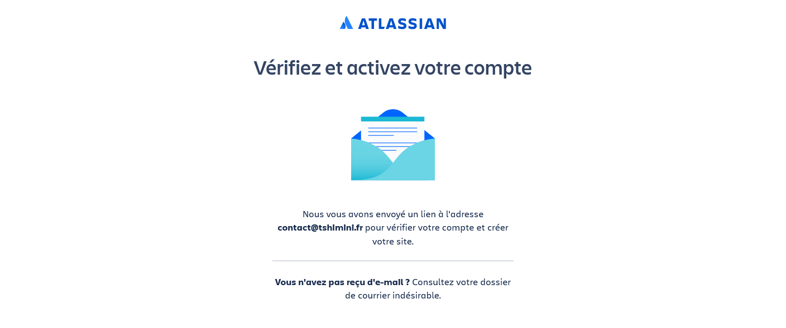
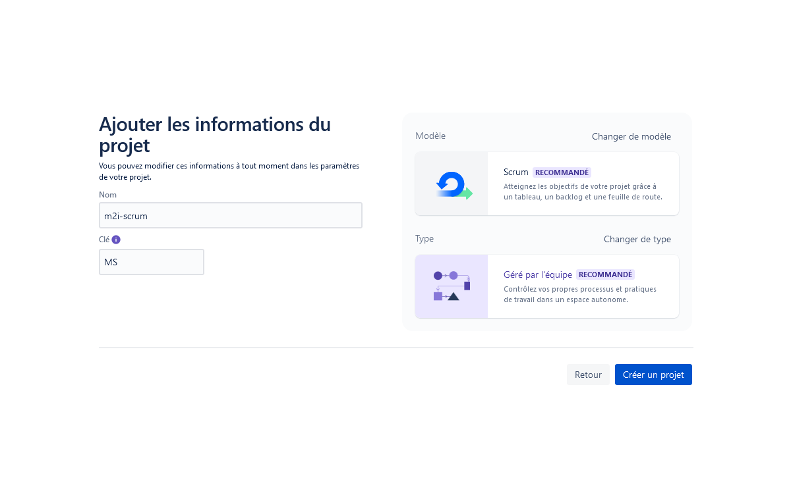
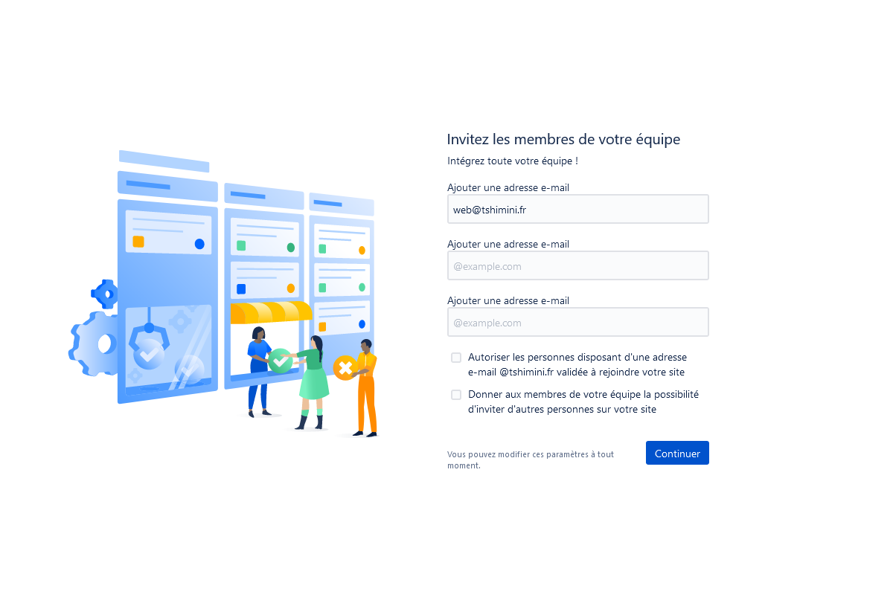

## Jira

Logiciel de gestion de projet.

### Mise en place

#### SCRUM Master : création projet Jira

1. Dans chaque groupe, désignez un responsable qui aura le rôle du *SCRUM Master* durant toute la série des exercices.
2. Le *SCRUM Master* va créer un projet Jira en suivant les indications ci-après.
3. A la fin de la création du projet :
- Invitez les autres membres du groupe en saisissant leurs adresses e-mails pour participer au projet
- Ajoutez l'extension *Story mapping*

- Ajoutez l'extension *Planning Poker*

#### Les autres membres

4. Au préalable, les autres membres de l'équipe doivent créer un compte à partir du [lien suivant](https://id.atlassian.com/signup)

### Création de projet par le SCRUM Master

[Lien pour créer un compte et un projet Jira](https://www.atlassian.com/fr/software/jira/free)

- Suivez les instructions et appuyez vous sur les captures d'écran ci-après si nécessaire.

#### Illustrations création compte et projet par le SCRUM Master

